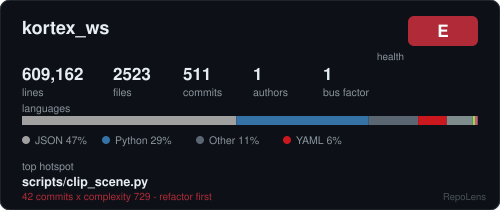
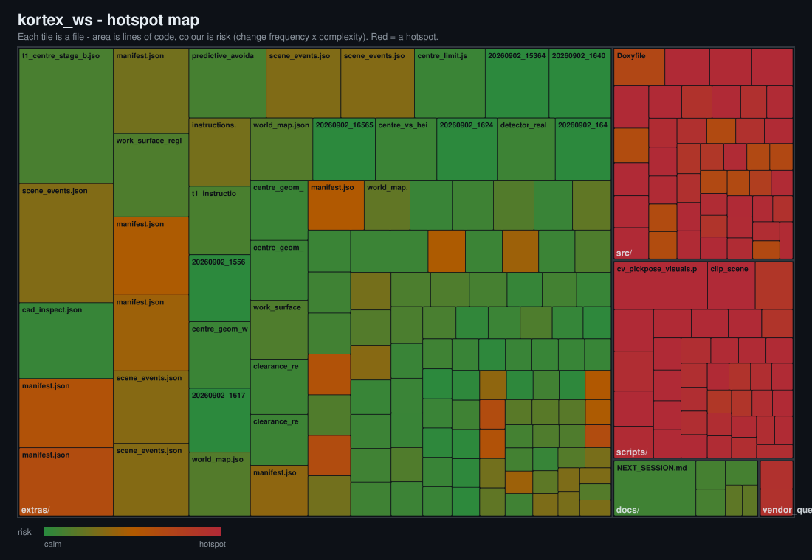
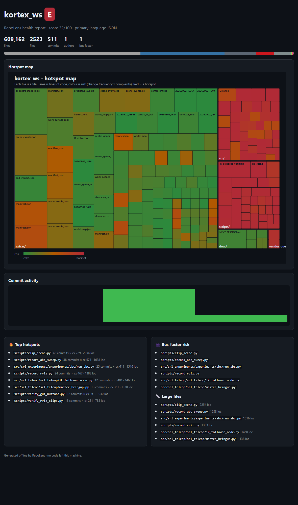

# RepoLens

**An offline X-ray of any git repository — in one command.** Point it at a repo and get a hotspot risk map, a plain-English health report, and a shareable card you can drop in your README. No API, no token, no account, nothing leaves your machine.

```bash
pip install git+https://github.com/megazron/repolens
repolens .
```

<p align="center">
  
</p>

<p align="center"><i>The card above is real RepoLens output. Generate your own and paste it into your README.</i></p>

---

## Why RepoLens

Most repo badges show vanity numbers — stars, commit counts, a language bar. They don't tell you **where the risk is**. RepoLens does one useful thing well: it finds the files that are **changed often and are complex** — the *hotspots* where bugs cluster and refactors pay off — and shows them at a glance.

- **Hotspot map** — a treemap of your codebase. Each tile is a file; area is lines of code; colour is risk (change-frequency × complexity). Red tiles are where your attention should go.
- **Health report** — a letter grade plus the specific files that need tests, the ones with a single author (bus-factor risk), the oversized files, and the risky files nobody has touched in a year.
- **Embeddable card** — a compact SVG for your README, so anyone can see the shape of the project in five seconds.
- **Fully offline** — it reads your local `git log` and your files. No network, no upload, no key. Safe for private and company code.

## The hotspot map

<p align="center">
  
</p>

Read it in one look: calm code is green, hotspots are red. In the map above — a 600k-line robotics research repo — the data and docs are calm while `scripts/` and `src/` are dense with red. That is exactly where the tests and refactors belong.

## The full dashboard

`repolens .` writes a self-contained `index.html` you can open in any browser (no server, no internet):

<p align="center">
  
</p>

## Install

```bash
pip install git+https://github.com/megazron/repolens
# or, from source:
git clone https://github.com/megazron/repolens && cd repolens
pip install -e .
```

Python 3.9+. The only requirement is `git` on your PATH. No third-party Python packages.

## Use

```bash
repolens .                       # full report -> ./repolens-report/ (index.html, hotspot.svg, card.svg, report.txt)
repolens report .                # print the text health report to the terminal
repolens card . -o card.svg      # just the embeddable card
repolens build /path/to/repo -o out/ --title "my project"
```

Then open `repolens-report/index.html`, or commit `card.svg` and embed it:

```md

```

## What the numbers mean

| Metric | Meaning |
|---|---|
| **risk** | percentile of (change frequency × complexity). A file that is edited constantly *and* is branchy is where defects concentrate. |
| **complexity** | count of branch points (`if`/`for`/`while`/`case`/`&&`/`?`/…) — a fast, language-agnostic proxy for cyclomatic complexity. |
| **churn** | number of commits that touched the file. |
| **bus factor** | the smallest number of authors responsible for more than half of all commits. `1` means the project depends on one person. |
| **health grade** | A+ to E, penalising concentrated hotspots, a low bus factor, oversized files, and stale hotspots. |

## How it works

1. **History** — one `git log --numstat` pass gives per-file churn, authors, first/last touch, and a monthly commit timeline.
2. **Structure** — each tracked text file is read locally for lines of code, language (by extension), and a branch-point complexity proxy. Binaries, vendored code and virtualenvs are skipped.
3. **Risk** — churn and complexity are converted to percentile ranks and multiplied, so "changed often *and* complex" rises to the top.
4. **Render** — a squarified treemap (Bruls–Huizing–van Wijk), a language bar, an activity sparkline and the card are built as plain SVG strings that read well in light and dark. The dashboard is a single self-contained HTML file.

Everything is standard-library Python. The whole thing runs on a laptop with no internet.

## Privacy

RepoLens never makes a network request. It shells out to `git` and reads files under the path you give it. Your code and history stay on your machine — which is why it is safe to run on private or client repositories where the hosted "readme stats" services are not an option.

## Roadmap

- A GitHub Action that regenerates and commits the card on every push, so the badge stays live.
- Coupling map: files that change together but live far apart.
- Per-author ownership overlay and knowledge-risk heatmap.
- Trend mode: compare two revisions and show what got riskier.
- `--json` output for CI gates (fail the build when a hotspot crosses a threshold).

## Contributing

Issues and pull requests welcome. Run the tests with:

```bash
PYTHONPATH=src python -m pytest -q
```

## License

MIT — see [LICENSE](LICENSE).
